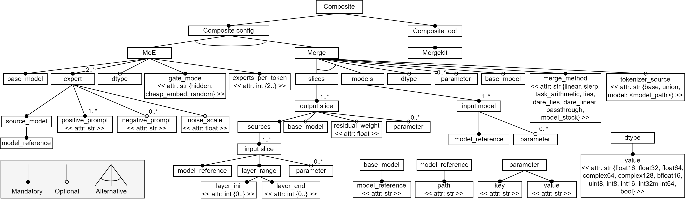

# Exploring the Use of Software Product Lines for the Combination of Machine Learning Models

Source code of the tool submitted to the [SPLC 2024](https://2024.splc.net/) conference.




### Requirements

- Python 3.11
- Recommended: Create a virtual environment (e.g. [venv](https://docs.python.org/3/library/venv.html), [conda](https://conda.io/projects/conda/en/latest/user-guide/tasks/manage-environments.html))

### Installation

```bash
git clone https://github.com/BESSER-PEARL/spl-for-ai
cd spl-for-ai
pip install -r requirements.txt
python main.py
```


## Authors

Marcos Gomez-Vazquez, Luxembourg Institute of Science and Technology

Jordi Cabot, Luxembourg Institute of Science and Technology. University of Luxembourg

## Acknowledgements

This project is supported by the Luxembourg National Research Fund (FNR) PEARL program, grant agreement 16544475.

### License

This project is licensed under the [MIT](https://mit-license.org/) license

Copyright © 2023 Luxembourg Institute of Science and Technology. All rights reserved.
